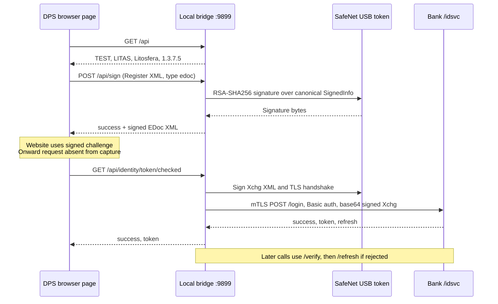

# Litosfera 1.3.7.5 login protocol

Analyzed JAR SHA-256: `0efeefc5d07430aedcfe35b50fdb760c1578cfb2dd9fda47e90974a04ff564c7`.
Manifest: main class `org.bol.Launcher`, build timestamp 2026-06-16, Java 11. The supplied browser trace is from the TEST / LITAS environment. Claims below come from that capture and `javap -c -p -constants` disassembly, not from assumptions about the website. No bank request was sent during development.

## Flow

The local Basic credentials are a compatibility gate, not the participant's real identity. Participant authentication comes from possession of the hardware private key, the certificate, and bank validation. The private key remains on the token. The JWT is issued by the bank, not constructed or signed by the local application.

## Browser-facing endpoints

| Request | Response / behavior |
|---|---|
| `GET /api` | Service metadata exactly matching the capture |
| `OPTIONS /api/sign` | CORS permits the DPS origin and Authorization header |
| `POST /api/sign` | JSON body even though Content-Type is `text/plain;charset=UTF-8`; fields `request` and `type` |
| `GET /api/identity/token/checked` | Returns `{success:true,token:...}` after acquisition or server-side verification |

The trace switches between `localhost` and `127.0.0.1`; both refer to the same local bridge. The Java servlet also has many unrelated file-exchange and control endpoints; these are not required by the supplied login trace and are not implemented.

## XML signatures

Both modes use SHA-256 digesting, RSA-SHA256 signatures and exclusive canonicalization without comments. XML signature RSA-SHA256 means PKCS#1 v1.5, not PSS. PSS is separately relevant to modern TLS handshakes.

`edoc`:

1. Wrap the incoming `Register` element in `EDoc`.
2. Place `ds:Signature` after `Register`.
3. Reference the whole document with URI="", using enveloped-signature and exclusive-c14n transforms.
4. Reference XAdES `SignedProperties` by its generated Id.
5. Leave `KeyInfo Id="KeyInfo"` empty, as in the capture.
6. Signed properties contain signing time, certificate SHA-256 digest, issuer/serial, the literal place placeholders, and claimed role "Some role".

The captured document digest is reproduced exactly:
`hl+t70PGvP7Pc2DwXx9odqMqal99WR6CKaFE35CaNjc=`.

`xchg`:

1. Start with an empty `Xchg/PyldDesc/ApplSpcfcInf/Sgntr` and empty `Pyld`.
2. Insert the signature inside `Sgntr`.
3. Include the signing certificate in `KeyInfo/X509Data`.
4. Sign three references: the envelope, `#KeyInfo`, and XAdES `SignedProperties`.

This extra `KeyInfo` reference and embedded certificate are important differences from the browser challenge signature. Reusing the `edoc` response for identity login would not match the Java code.

When a current LB-LITAS-CA CRL is available, the Java signer adds a `ds:QualifyingPropertiesReference` with URI `http://www.lb.lt/pki/crl/?` followed by Base64(SHA-1(CRL DER)). This SHA-1 is a CRL locator, not the XML signature digest algorithm. The Go prototype supports this from a supplied, authenticated current CRL rather than duplicating Java's CRL cache/downloader.

## Identity service

Defaults found in `Launcher` and `XenolitasToken`:

| Environment | Base URL |
|---|---|
| TEST | `https://dstestlitas.lb.lt/idsvc` |
| PROD | `https://dslitas.lb.lt/idsvc` |

Every operation below uses HTTP POST, JSON, Basic `user1:pass1`, and the client's SSL socket factory backed by the PKCS#11 key manager. Java uses a 20-second request timeout here.

| Path | Request body | Successful response |
|---|---|---|
| `/login` | `{"xml":"BASE64_OF_SIGNED_XCHG_UTF8"}` | `success`, `token`, `refresh` |
| `/verify` | `{"token":"ACCESS_TOKEN"}` | `success:true` |
| `/refresh` | `{"refresh":"REFRESH_TOKEN"}` | `success`, new `token`, new `refresh` |
| `/retract` | `{"token":"ACCESS_TOKEN"}` | `success:true`; not used by this minimal bridge |

`/token/checked` first verifies an existing access token. Without one it refreshes if possible, otherwise generates a signed Xchg and logs in. Java also falls back after authentication/security errors. Go follows that path for rejected authentication; network failures and server errors are returned without attempting more login operations.

The Java key manager prefers the signing certificate alias when its issuer matches the server's requested issuers, then delegates to its original key manager. Therefore XML and TLS can use the same certificate, but distinct certificate selection remains possible and is configurable in Go.

## Evidence map

These are saved disassemblies in `analysis/`:

- `org.bol.Launcher.txt`: TEST/PROD identity URL defaults and configuration keys.
- `org.bol.server.ConsoleServlet.txt`: API routes, `checked` verify/refresh/login control flow, and JSON responses.
- `org.bol.transport.HttpsTransport.txt`, `loginToXenolitasRepo`: empty Xchg template and signing call.
- `org.bol.server.XenolitasToken.txt`: POST transport, Basic credentials, Base64 XML request field, identity endpoints and token storage.
- `org.bol.crypto.SignCryptoCore.txt`: edoc/xchg signing algorithms, signature placement, KeyInfo reference, and CRL hash.
- `org.bol.crypto.SignCryptoCore$3.txt`: signing-time and literal XAdES place/role values.
- `org.bol.crypto.CryptoCore$4.txt`: TLS client-certificate alias preference.

The trace does not contain the browser-to-bank request that consumes `signed`, nor the actual bank identity HTTP exchange. Those browser details cannot be reconstructed from this capture alone. The identity exchange above is established from bytecode. End-to-end interoperability still requires a live DPS test using the user's token.
